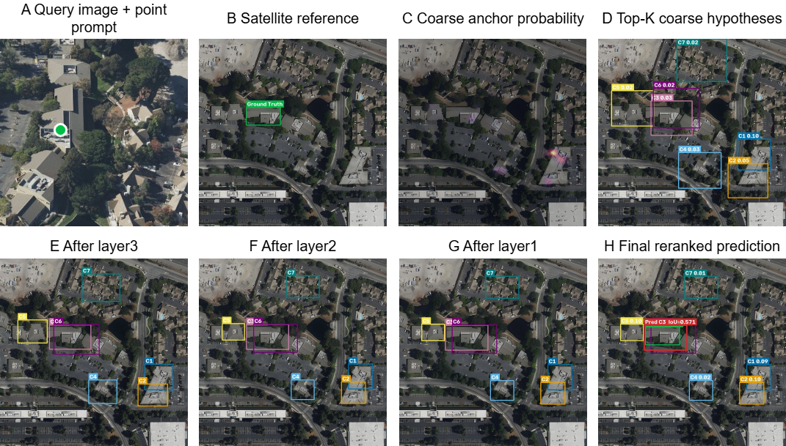
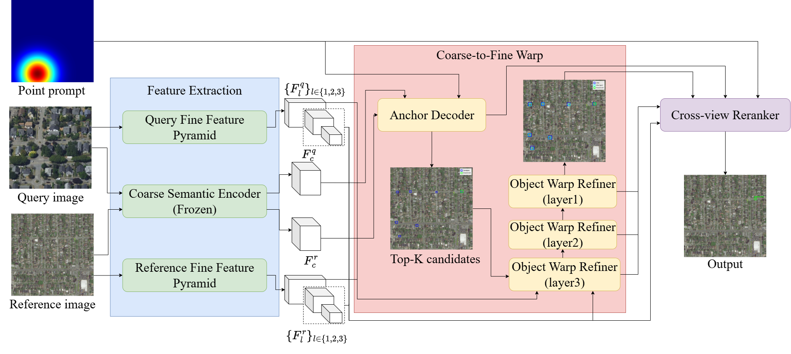

# PCWNet

**Probabilistic Coarse-to-Fine Warp Network for Cross-View Object Geo-Localization**

Official implementation of the paper *PCWNet: Probabilistic Coarse-to-Fine Warp Network for Cross-View Object Geo-Localization*.

---

## Abstract

> Cross-view object geo-localization (CVOGL) seeks the satellite-image bounding box of an object indicated by a point prompt in a Ground or Drone query. Viewpoint, scale, and appearance changes can leave several satellite regions equally plausible. Existing one-shot pipelines nevertheless commit to a single location without the chance for correction. We introduce the Probabilistic Coarse-to-Fine Warp Network (PCWNet), drawing its order of reasoning from remote-sensing image registration. The Prompt-conditioned Anchor Decoder does not treat the strongest anchor as a final answer; it retains the Top-*K* distinct modes of the anchor distribution. Each mode carries an object state with center, size, and certainty, which the Object Warp Refiner updates through candidate-conditioned local correlations across the feature pyramid. Only after these updates does the Cross-view Reranker compare prompt-local interactions, anchor evidence, geometry, certainty, and refinement history. In this way, PCWNet turns CVOGL into the progressive verification and calibration of multiple hypotheses. On the CVOGL test split, it reaches **80.68%** Acc@0.25 and **72.97%** Acc@0.50 for Drone-to-Satellite, surpassing ReCOT by 2.47 and 0.62 percentage points. Ground-to-Satellite Acc@0.25 is the best in the comparison at **53.34%**, while Acc@0.50 reaches 47.07%. The ablations associate these results with coarse candidate retention, multi-scale geometric correction, and cross-view selection.

---

## Overview

**Figure 1** shows an inference example of the coarse-to-fine candidate evolution. The initial coarse candidate is offset from the ground-truth box; the successive Object Warp Refiner stages correct its geometry, and the Cross-view Reranker selects the final corrected candidate.

<div align="center">
  
</div>

**Figure 2** presents the PCWNet model architecture. The shared Coarse Semantic Encoder and the two Fine Feature Pyramid branches feed the Prompt-conditioned Anchor Decoder, the layer3–layer1 Object Warp Refiner stages, and the Cross-view Reranker.

<div align="center">
  
</div>

---

## Downloads

### Pretrained Models

| Model                      | Task                | Description                                | Link                                                                                              |
| :------------------------- | :------------------ | :----------------------------------------- | :------------------------------------------------------------------------------------------------ |
| `DroneAerial.pth`          | Drone-to-Satellite  | Best validation checkpoint (main training) | [Download](https://drive.google.com/file/d/11JW1yKdkb3G0Rsve_dckMfkwEnNVaBqR/view?usp=drive_link) |
| `DroneAerial_finetune.pth` | Drone-to-Satellite  | Train+val fine-tuned checkpoint            | [Download](https://drive.google.com/file/d/12y9fbpa5d6PmUYirfAYpL6BwxAyxnpnf/view?usp=drive_link) |
| `SVI.pth`                  | Ground-to-Satellite | Best validation checkpoint (main training) | [Download](https://drive.google.com/file/d/1ur_yeYJjRlXGOniH-rytHO-ZH6sqArPf/view?usp=drive_link) |
| `SVI_finetune.pth`         | Ground-to-Satellite | Train+val fine-tuned checkpoint            | [Download](https://drive.google.com/file/d/123Biz7oAP59ZW2a7N-nR7-QR8Os__UQF/view?usp=drive_link) |

Place the downloaded weights under `saved_models/`:

```text
saved_models/
├── DroneAerial.pth
├── DroneAerial_finetune.pth
├── SVI.pth
└── SVI_finetune.pth
```

### Dataset

The CVOGL benchmark contains two object-level cross-view tasks:

- **Drone-to-Satellite** (`CVOGL_DroneAerial`): a 256×256 Drone query and a 1024×1024 satellite reference.
- **Ground-to-Satellite** (`CVOGL_SVI`): a 256×512 street-view query and a 1024×1024 satellite reference.

| Dataset | Link                                                                                           |
| :------ | :--------------------------------------------------------------------------------------------- |
| CVOGL   | [Download](https://drive.google.com/file/d/1WCwnK_rrU--ZOIQtmaKdR0TXcmtzU4cf/view?usp=sharing) |

After downloading, extract it so that the directory layout matches:

```text
data/
├── CVOGL_DroneAerial/
│   ├── CVOGL_DroneAerial_train.pth
│   ├── CVOGL_DroneAerial_val.pth
│   ├── CVOGL_DroneAerial_test.pth
│   ├── query/        # Drone query images
│   └── satellite/    # satellite reference images
└── CVOGL_SVI/
    ├── CVOGL_SVI_train.pth
    ├── CVOGL_SVI_val.pth
    ├── CVOGL_SVI_test.pth
    ├── query/        # Ground (street-view) query images
    └── satellite/    # satellite reference images
```

---

## Environment Setup

The reference environment used in the paper is:

- Ubuntu 20.04.6 LTS
- AMD Ryzen 9 5900X 12-Core Processor
- NVIDIA GeForce RTX 3090 (24 GB)
- Python 3.10.20

Create a Python 3.10 environment and install PyTorch with a CUDA build that matches your driver, then install the remaining dependencies:

```bash
conda create -n pcwnet python=3.10

conda activate pcwnet

pip install -r requirements.txt
```

Dependencies (`requirements.txt`): `torch>=2.1`, `torchvision>=0.16`, `numpy`, `opencv-python-headless`, `albumentations`, `matplotlib`.

---

## Training

PCWNet trains the two CVOGL tasks **separately**. The default hyperparameters follow the paper: 40 epochs, batch size 12, head learning rate 1e-4, backbone learning rate 1e-5, 2 warm-up epochs, weight decay 5e-4, and 5 epochs of train+val fine-tuning after model selection.

### Drone-to-Satellite

```bash
python src/train.py --data_name CVOGL_DroneAerial --checkpoint saved_models/DroneAerial_best.pth
```

### Ground-to-Satellite

```bash
python src/train.py --data_name CVOGL_SVI --checkpoint saved_models/SVI_best.pth
```

Key options (`python src/train.py --help` for the full list):

| Option              | Default                        | Description                               |
| :------------------ | :----------------------------- | :---------------------------------------- |
| `--data_root`       | `./data`                       | Dataset root directory                    |
| `--data_name`       | `CVOGL_DroneAerial`            | `CVOGL_DroneAerial` or `CVOGL_SVI`        |
| `--epochs`          | `40`                           | Main training epochs                      |
| `--batch_size`      | `12`                           | Batch size                                |
| `--lr`              | `1e-4`                         | Head learning rate                        |
| `--backbone_lr`     | `1e-5`                         | Fine feature pyramid learning rate        |
| `--topk`            | `7`                            | Number of retained candidate hypotheses   |
| `--finetune_epochs` | `5`                            | Train+val fine-tuning epochs (0 disables) |
| `--checkpoint`      | `saved_models/PCWNet_best.pth` | Where the best checkpoint is saved        |

### Evaluation

Evaluate a trained checkpoint on the validation or test split:

```bash
# Drone-to-Satellite
python src/train.py --data_name CVOGL_DroneAerial --eval --resume saved_models/DroneAerial_best.pth --split test

# Ground-to-Satellite
python src/train.py --data_name CVOGL_SVI --eval --resume saved_models/SVI_best.pth --split test
```

Reported metrics include `iou`, `acc25`, `acc50`, and the candidate-level `oracle_*` / `selection_*` diagnostics.

---

## Inference

`src/demo.py` runs a single sample through the model and exports the candidate lifecycle as a set of images (point prompt, ground truth, coarse Top-K candidates, layer3/layer1 refinement, and the final reranked prediction).

```bash
python src/demo.py --data_name CVOGL_DroneAerial --split test --index 0 --checkpoint saved_models/DroneAerial_best.pth --save_dir vis
```

This writes `01_query_point_prompt.png` … `06_final_reranked_prediction.png` into `vis/`.

| Option         | Default                        | Description                        |
| :------------- | :----------------------------- | :--------------------------------- |
| `--data_name`  | `CVOGL_DroneAerial`            | `CVOGL_DroneAerial` or `CVOGL_SVI` |
| `--split`      | `test`                         | `train`, `val`, or `test`          |
| `--index`      | `0`                            | Sample index within the split      |
| `--checkpoint` | `saved_models/PCWNet_best.pth` | Checkpoint to load                 |
| `--save_dir`   | `vis`                          | Output directory                   |
